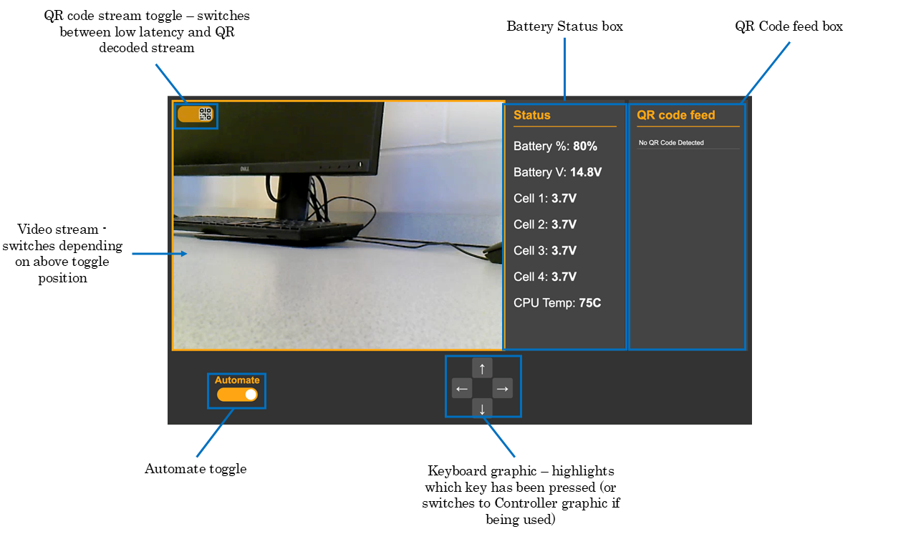

# Raspberry Pi Mars Rover GUI
___

This is a **web-based GUI for a Raspberry Pi Mars Rover** to be entered into the [UK-SEDS Olympus Rover Trials](https://ukseds.org/ignition/competitions/olympus-rover-trials/). 




## Features:

---


- Displays 2 streams which can be toggled between:
    - An **ultra low latency stream** for optimal control of the rover (~100ms)
    - An **OpenCV-based QR decoding stream**

- Text box for status updates, such as battery charge, temperature etc...
- Text box for QR code data decoded by the rover. 
- Capable of receiving input from both keyboard, or a bluetooth game controller.
- Connects to the Raspberry Pi onboard the rover via WiFi, over a local network. 

## Prerequisites:
---
### Raspberry Pi Requirements
- For this rover, a **Raspberry Pi 5 8GB** was used, with **Ubuntu 24.04**
- The programme was also tested with a Raspberry Pi 3 - however, it would usually lock up within a couple minutes of running the programme.
- There is no reason using Raspberry Pi OS wouldn't work too - Ubuntu was chosen for our use case to enable potential expansion using ROS2

### Configuring MediaMTX

This programme uses **MediaMTX** for low latency streaming from the RaspPi, to the laptop the GUI is running on. MediaMTX is a media server and protocol proxy: it receives two RTSP streams, and converts them to WebRTC streams, which are natively supported by browsers

It is necessary to download, configure and run MediaMTX before running the rest of the script: 


1. First download the appropriate version of MediaMTX from: https://github.com/bluenviron/mediamtx

2. Configure the .yaml file for **two** WebRTC endpoints:
    - /LowLat
    - /QRDecode

### OpenCV with Gstreamer Plugin
To publlish OpenCV-edited frames to the MediaMTX server (a blue bounding box is overlayed when a QR code is found), the **Gstreamer plugin** is used. 

To enable this, OpenCV must be recompiled with the Gstreamer plugin enabled. The full instructions for this can be found in the MediaMTX documentation: https://github.com/bluenviron/mediamtx

(See: Publish to server -> By software -> OpenCV)

## Using the GUI:
---

1. Connect to the RasPi via **SSH** (or use a HDMI cable and keyboard if accessible)

2. Clone this repo on the RasPi

3. Ensure MediaMTX is downloaded and configured
 
2. Run the Mediamtx executable, wherever you installed it:
```./mediamtx```

3. Run the Flask app:
```python3 app.py```

4. On a browser (Chrome recommended), navigate to:
*http://<YOUR_PI_IP>:5000*

## Common Errors:
---
- Ensure **2** USB cameras are plugged into the RasPi
- Ensure the laptop running the GUI and RasPi are connected to the **same network**
- In the code it is assumed the two USB cameras are found at **dev/video0** and **dev/video2**. Occasionally this won't be the case, and you will have to manually identify which /dev/video* node points to each USB camera.

## To Do:
---
- The rover should become autonomous when the '*automate*' toggle is clicked
- Actual code for outputting to the PWM pins / receiving from the I2C pins on the RasPi
